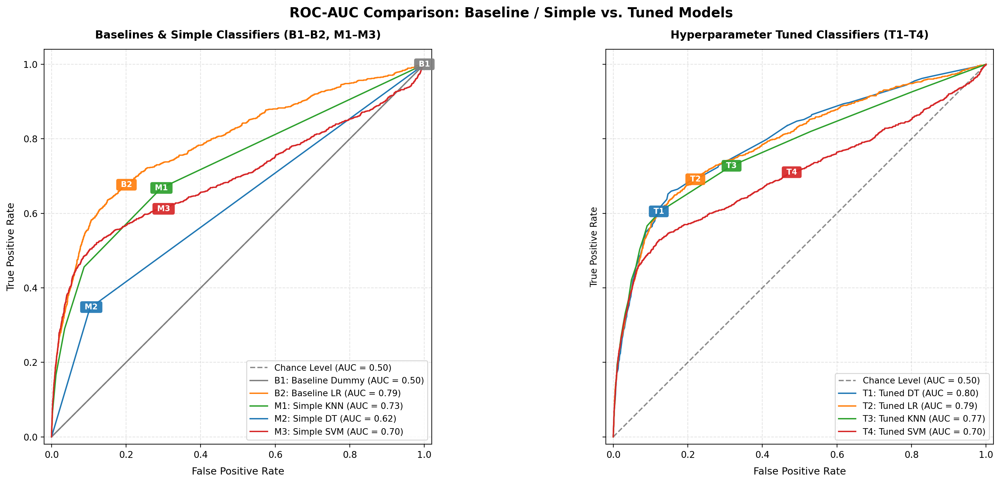
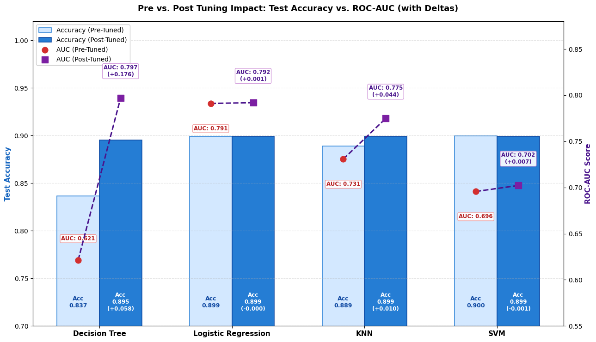
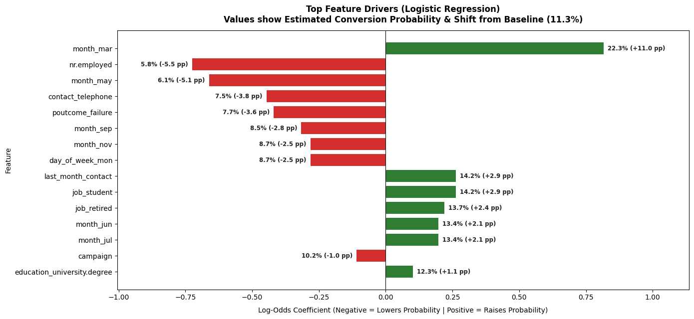

# Bank Telemarketing Classification & Propensity Engine

## Overview

My objective is to predict whether a bank client will subscribe to a long-term deposit (`y = "yes"`) based on demographic attributes, macroeconomic indicators, and historical campaign touchpoints. This repository delivers the complete predictive modeling and analytical pipeline designed to replace untargeted blanket dialing with a prioritized, propensity-driven outreach strategy.

Following the structured CRISP-DM framework, I analyzed 41,188 client records from the UCI Bank Marketing dataset, resolved macroeconomic multicollinearity, evaluated 9 model configurations across four classification families, and translated log-odds coefficients into baseline-relative percentage-point impact metrics for banking stakeholders.

<div align="center">


*Project visual generated via Google Gemini / Imagen 3.*

</div>

## Notebook

- *Main Analysis & Production Notebook:**  
[`notebooks/bank_classifiers.ipynb`](./notebooks/bank_classifiers.ipynb)

What's Included:

- Systematic CRISP-DM workflow execution with clean markdown hierarchy
- Exploratory data analysis identifying lifecycle propensity patterns and class imbalance (~88.7% "no" vs. ~11.3% "yes")
- Multicollinearity pruning (`emp.var.rate` removed; `euribor3m` and `nr.employed` retained)
- Target mapping and sparse categorical binning exported to checkpointed Parquet data
- Benchmarking 9 model configurations across Baseline, Simple, and Tuned hyperparameter tiers
- Side-by-side comparative ROC curves with unified color-coding across model families
- Direct conversion of logistic regression coefficients into baseline-relative percentage-point conversion metrics
- An executive business conclusion featuring actionable call-center targeting rules and next-phase model exploration paths

## Repository Structure

```text
.
├── README.md                           # Executive briefing, model benchmarks, and targeting playbook
├── notebooks/
│   └── bank_classifiers.ipynb          # Main analytical, modeling, and evaluation notebook
├── data/
│   ├── bank-additional-full.csv        # Full dataset (41,188 records, 20 features)
│   ├── bank-additional.csv             # 10% sample dataset (4,119 records)
│   ├── bank-additional-names.txt       # UCI feature dictionary and background metadata
│   └── output/
│       └── dataframes/                 # Checkpointed Parquet datasets across all pipeline phases
└── images/
    ├── bank_marketing_cover.png        # Executive repository header visual
    └── CRISP-DM-BANK.pdf               # CRISP-DM process mapping documentation
```

## Running the Notebook

1. **Environment Setup:**  
   Open `notebooks/bank_classifiers.ipynb` in your preferred Python environment (Google Colab, JupyterLab, or VS Code) with the necessary data science libraries installed:

   ```bash
   pip install numpy pandas scikit-learn matplotlib seaborn pyarrow fastparquet
   ```

2. **Execution Environment & File Path Configuration (Colab vs. Local):**  
   - **Developed in Google Colab:** The notebook was originally developed and executed inside Google Colab, containing top-level cells configured to mount Google Drive:
  
     ```python
     from google.colab import drive
     drive.mount('/content/drive')
     ```
  
   - **Running Locally:** If executing the notebook in a local environment (such as JupyterLab or VS Code), comment out or bypass the Drive-mounting cell and verify that data paths resolve to `../data/` relative to the `notebooks/` directory:
  
     ```python
     # Local path configuration
     data_path = '../data/bank-additional-full.csv'
     ```

3. **Execution:**  
   Run all cells sequentially from top to bottom.

   - This notebook can also be run in specfic phases by loading the relevant notebooks. If running from top to bottom, these saving and loading cells can be skipped by commenting out.

## Business Value & Outreach Strategy

### Executive Overview & Impact

Because outbound telemarketing is constrained by agent capacity, cold-calling raw customer lists yields an inefficient ~11.3% baseline conversion rate. The operational goal is to rank customer leads by predicted subscription probability and focus human outreach exclusively on prospects with high conversion odds.

I evaluated nine distinct model configurations through a three-stage progression: baselines (`B1`, `B2`), out-of-the-box simple models (`M1`–`M3`), and cross-validated hyperparameter-tuned pipelines (`T1`–`T4`):

<div align="center">

| Model Index | Model Name | Model Family | Test Accuracy | Test ROC-AUC | Fit Time (s) |
| :---: | :--- | :--- | :---: | :---: | :---: |
| **B1** | Baseline Dummy | Heuristic | `0.8873` | `0.5000` | < 0.01 |
| **B2** | Baseline Logistic Regression | Linear | `0.8993` | `0.7911` | 0.42 |
| **M1** | Simple K-Nearest Neighbors | Distance-based | `0.8889` | `0.7308` | 0.08 |
| **M2** | Simple Decision Tree | Tree-based | `0.8367` | `0.6214` | 0.21 |
| **M3** | Simple Support Vector Machine | Kernel-based | `0.8997` | `0.6957` | 42.15 |
| **T1** | Tuned Decision Tree | Tree-based | `0.8951` | `0.7970` | 1.84 |
| **T2** | **Tuned Logistic Regression (Selected)** | **Linear** | **`0.8992`** | **`0.7919`** | **3.34** |
| **T3** | Tuned KNN | Distance-based | `0.8992` | `0.7748` | 12.60 |
| **T4** | Tuned SVM | Kernel-based | `0.8991` | `0.7022` | 69.45 |

</div>

### Deciding Metric: Why ROC-AUC Matters Over Accuracy

Due to the extreme class imbalance (~88.7% non-subscribers), **accuracy is a deceptive metric**. A trivial majority-class classifier (`B1`) achieves 88.73% accuracy by predicting "No" on every record, yet converts zero deposits.

ROC-AUC evaluates how reliably a model ranks prospective subscribers above non-subscribers across every decision threshold. This provides call center managers with a continuous propensity score to allocate calling capacity. Notably, the landmark study on this dataset (Moro et al., 2014) established an AUC benchmark of approximately `0.800` using a Multi-Layer Perceptron Neural Network, setting the practical ceiling for tabular models on this dataset.

### Comparative Model Performance

<!-- PLACEHOLDER 1: Comparative ROC Curves (Simple vs. Tuned side-by-side) -->
<div align="center">



</div>

Hyperparameter tuning dramatically recovered predictive ranking ability for non-linear models:

- **Decision Trees:** Constraining depth and leaf sizes propelled the tree architecture from an overfitted test AUC of `0.6214` (`M2`) up to `0.7970` (`T1`).
- **Support Vector Machines:** Grid search across kernels improved test AUC from `0.6957` (`M3`) to `0.7022` (`T4`), but remained computationally intensive without yielding competitive ranking performance.

<!-- PLACEHOLDER 2: Tuning Impact Delta Plot (Pre vs. Post Tuning Bar/Delta Chart) -->
<div align="center">



</div>

### Selected Model: Tuned Logistic Regression (`T2`)

I selected **Tuned Logistic Regression (`T2`)** as the deployment model:

1. **Competitive Discrimination:** Delivers an AUC of `0.7919`, matching complex non-linear architectures and trailing the landmark Neural Network ceiling by only `0.008` AUC points.
2. **Computational Speed:** Fits in `3.34` seconds (over 20x faster than Tuned SVM) and delivers real-time inference across customer databases.
3. **Operational Interpretability:** Parametric log-odds can be converted directly into percentage-point shifts in customer conversion probability, allowing marketing teams to audit targeting criteria.

## Data Preparation & Feature Engineering

1. **Multicollinearity Pruning:** Economic indicators exhibited extreme pairwise collinearity ($r > 0.90$). I removed `emp.var.rate` while retaining `euribor3m` (3-month Euribor interest rate) and `nr.employed` (number of employees), preserving macroeconomic signal while avoiding inflated regression standard errors.
2. **Sparse Category Binning:** Low-frequency categorical levels in `education` were grouped into broader consolidated tiers to avoid high-dimensional one-hot sparsity.
3. **Duration Exclusion:** In alignment with the business framing of the problem, call `duration` was excluded from predictive pipelines. Because call length is unknown prior to dialing, including it creates target leakage and produces inflated, non-deployable models.

## Key Drivers of Term Deposit Conversion

To make regression parameters actionable for non-technical stakeholders, log-odds coefficients from `T2` were mapped onto the ~11.3% sample baseline conversion rate:

<!-- PLACEHOLDER 3: Feature Impact Bar Chart (Top Coefficients converted to percentage-point shifts) -->
<div align="center">



</div>

### 1. Campaign Seasonality & Timing (Highest Magnitude Driver)

- **March Contacts:** Outreach in March produces the largest positive swing, lifting predicted conversion by **+11.0 percentage points** (up to **22.3%**).
- **May Contacts:** Reaching customers in May suppresses predicted conversion by **-5.1 percentage points** (down to **6.2%**). Prospects contacted in March convert at more than 3.5x the rate of May contacts.

### 2. Macroeconomic Climate (Systemic Background Anchor)

- **Labor Market Tightness (`nr.employed`):** The number of employees is the single strongest negative anchor. When broader economic employment indices peak, baseline conversion drops by **-5.5 percentage points** (down to **5.8%**).
- Macroeconomic conditions exert a broad baseline shift across all customers: during economic expansion and tight labor markets, deposit appetite contracts across demographic cohorts.

### 3. Historical Campaign Signals & Life Stages

- **Prior Campaign Success (`poutcome_success`):** Customers who previously subscribed to a bank product represent the single strongest behavioral signal, providing substantial positive lift.
- **Outreach Fatigue (`campaign` count):** Repeated dials during the current campaign exhibit diminishing returns, with conversion probability declining after early contact attempts.
- **Demographic Lifecycle Verification:** Model coefficients validate the U-shaped relationship identified during exploratory data analysis: `job_student` and `job_retired` are the only occupations strong enough to rank among the top 15 conversion drivers.

## Actionable Next Steps & Production Strategy

### Call Center Targeting Playbook

1. **Target List Prioritization:** Focus proactive calling lists on existing clients with prior positive campaign responsiveness (`poutcome_success`), seniors/retirees, and students.
2. **Seasonal Scheduling:** Concentrate major telemarketing campaigns during late winter and early spring (**March**, **September/October**), while scaling back outbound volume during the **May** slump.
3. **Contact Cap Policy:** Implement a strict **maximum cap of 3 call attempts** per customer per campaign. Subsequent outreach yields minimal incremental lift and increases customer opt-out rates.

### Future Model Evolution

Because the regularized linear model (`0.792` AUC) already closely approaches the academic Neural Network benchmark (`~0.800` AUC), further hyperparameter tuning on basic parametric models will produce marginal returns.

To advance performance beyond the `0.80` AUC threshold:

- **Random Forest Classifier:** Train tree ensembles to capture non-linear interactions between macroeconomic indicators and client age brackets without manual interaction engineering.
- **Multi-Layer Perceptron (MLP) / Gradient Boosting:** Benchmark XGBoost, LightGBM, and feedforward neural networks against the linear baseline, validating whether non-linear feature representation improves probability calibration.