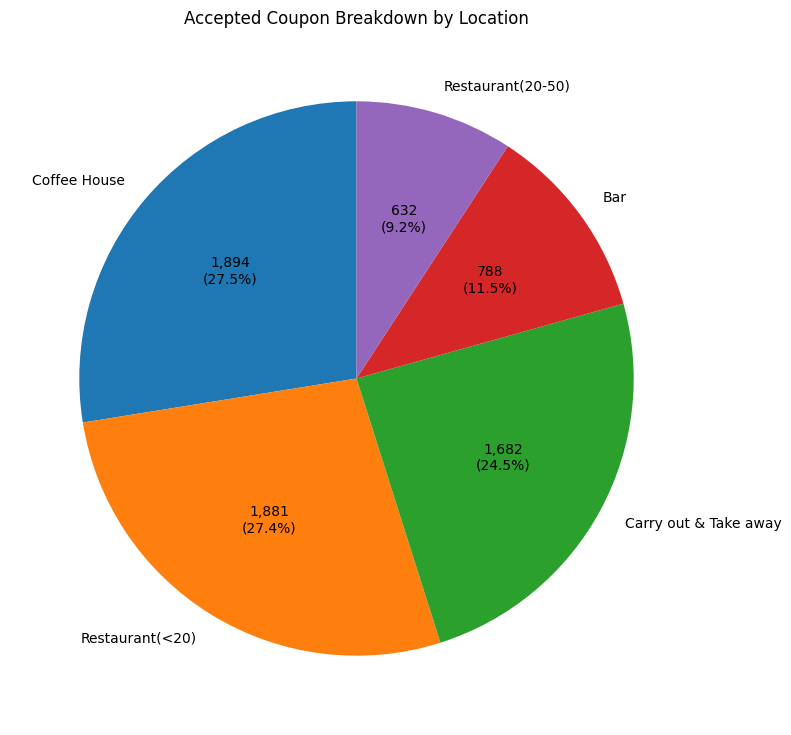

# Customer Coupon Acceptance Analysis

## Overview

An analytical exploration of driver behaviors and situational factors that influence whether a customer accepts a mobile coupon delivered while driving. This study utilizes data visualization and conditional probability distributions on the given dataset to attempt to answer this primary question: **which factors drive the acceptance rate of a coupon**?

This README captures some of the results from this analsys; a comprehensive look at my observations and conclusions can be found in the notebook.

## [Click here to open the `coupon_analysis` Notebook](notebooks/coupon_analysis.ipynb).

### Key Technologies and Techniques

Thisproject utilizes **Python**, **Pandas**, and **NumPy** for data engineering alongside **Matplotlib** and **Seaborn** for <u>exploratory data analysis (EDA)</u>. This study identifies how target demographics, environmental constraints (weather, time of day), and passenger contexts compound to predict coupon validation. 

The final findings serve not only as providing context for coupon acceptance, but also as recommendations to drive further areas of acceptance growth.

### Project Structure

```
├── data/
│   └── coupons.csv               # Raw dataset
├── data/                         # Copies of visualizations
│   └── *.png
├── notebooks/                    # Copies of visualizations
│   └── coupon_analysis.ipynb     # Jupyter notebook    
└──README.md                      # You are here!
```

## Dataset

- **Source:** UCI Machine Learning Repository (Amazon Mechanical Turk survey)
- **Size:** 12,684 observations, 26 features:
  
  ```
    #   Column                Comment
    ---  ------               --------------  ----- 
    0   destination           headed to "home", "office", "other"
    1   passanger  [sic]      with "kid(s)", "partner", "friend(s)", "Alone"
    2   weather               "sunny", "rainy", "snowy"
    3   temperature           fixed values representing "cold", "warm", "hot"
    4   time                  fixed values represetnting time of day
    5   coupon                category of coupon e.g. "bar", "CoffeeHouse"
    6   expiration            time till expiry ranging from `2h` to `1d`
    7   gender                "Male" or "Female"
    8   age                   fixed values representing stages of life
    9   maritalStatus         type of partner, single or widowed
    10  has_children          1,2 or more kids
    11  education             fixed values representing highest education
    12  occupation            various industries
    13  income                various income ranges
    14  car                   type of vehicle when coupon was received
    15  Bar                   fixed values representing visit frequency
    16  CoffeeHouse           fixed values representing visit frequency
    17  CarryAway             fixed values representing visit frequency
    18  RestaurantLessThan20  fixed values representing visit frequency
    19  Restaurant20To50      fixed values representing visit frequency
    20  toCoupon_GEQ5min      single bit representing time to coupon location
    21  toCoupon_GEQ15min     single bit representing time to coupon location
    22  toCoupon_GEQ25min     single bit representing time to coupon location
    23  direction_same        single bit representing coupon direction along the way
    24  direction_opp         single bit representing coupon direction opposite the way
    25  Y                     Target Value: Single bit representing coupon was accepted
  ```

## Data Cleaning & Preprocessing

Before jumping into data analysis, a first-pass of the 12,684 records was done to validate structure and data integrity. This revealed several columns with missing (`NaN`) values:

```
      column             na_count    na_percent
14    car                   12576       99.1485
15    Bar                     107        0.8436
16    CoffeeHouse             217        1.7108
17    CarryAway               151        1.1905
18    RestaurantLessThan20    130        1.0249
19    Restaurant20To50        189        1.4901
```

- **Behavioral Frequency Columns (`Bar`, `CoffeeHouse`, `CarryAway`, `RestaurantLessThan20`, `Restaurant20To50`):** Missing values ranged from `0.84%` to `1.71%`.  If the occurences of data were higher like say 10%, I might've distributed them based on the average of the other responses, or based on some other parameter; for example, we could correlate `Restaurant20To50` with `income` in the original data set and distribute it that way. We could also keep the data, as nulls in one column may still have usable data in the other, and we can ignore at the time of computation. However, for the sake of simplicity and due to the very low occurence of invalid data, I opted to remove this data.

- **`car` (99.15% missing):** For this column though, it is interesting because the vast majority >99% is null. Taking a closer look at the unique values, we can see

    ```
    ====car====
    car
    NaN                                         12576
    Scooter and motorcycle                         22
    Mazda5                                         22
    do not drive                                   22
    crossover                                      21
    Car that is too old to install Onstar :D       21
    ```

    It is odd that for the `car` column, there is no `car` value; in fact, the results seem to indicate that these are all non-cars or in the last case, cars that do not have "Onstar". Looking up this company at https://www.onstar.com/ shows connected vehicles service. It is safe to assume then, that the null values are just various types of cars that may have been removed for anonymity or some other reason e.g. the question may have been "indicate mode of transport if you don't use an OnStar car". I feel comfortable filling these values with just "car".

---

## Key Findings by Core Problems

As mentioned above, findings in this README are an abridged version of what is in the [notebook](notebooks/coupon_analysis.ipynb); that contains a full series of observations and conclusions as well as the full sequence of steps to reach them.

### 1. Overall Acceptance Rate

- **56.93%** of all coupons were accepted
- Acceptance rate varies between different coupon categories significantly: here is the each category's share of the accepted coupons:



- Acceptance rate was heavily influecnced by visit frequency across all categories - regular visitors were more likely to use a coupon for their coupon category of their destination
- As the `temperature` improved, both the overall quantity of coupons and the acceptance rate increased, going from `53.7%` to √with about triple the sample size.

### 2. Bar Coupons Analysis

- `Bar` coupons have the lowest local acceptance rate of `41.2%` and the lowest share of the global acceptance rate.
- **Habitual Drivers vs. Others:** Drivers who visit bars at least once a month display a significantly higher coupon acceptance rate compared to those who go less frequently or never. However, in raw numbers, the three or less bar goers drive the vast majority (`81.3%`) of the total coupon acceptances.
- **The Age & Social Dynamic:** Younger cohorts (under age 30) exhibit an increased probability of accepting bar coupons, particularly when driving with friends as passengers compared to driving solo. In some target groups, the acceptance rate of these target groups rises to the upper `60%`.
- **Occupational Flexibility:** Drivers with flexible occupations or non-traditional corporate structures show higher conversion rates for spontaneous detours, reaching to more than `70%`.

### 3. Independent Investigation Focus - Boosting Acceptance Rate by Identifying Friction

Rather than reviewing demographic attributes or environmental variables in isolation, this independent investigation focused on the **Compounding Friction Model**.

As per the [Theory of Constraints](https://en.wikipedia.org/wiki/Theory_of_constraints), I wanted to focus my attention on boosting the lower acceptance rate coupons rather than the higher ones.

Since we examined the lowest acceptance rate which is `bar`, I want to see how we can improve the next lowers which is `Restaurant(20-50)` with `44.6%`. Additionally, this coupon group's accepted coupons accout for less than 10% of all coupons that were accepted, which is the lowest, although this is also because it has the lowest quantity.

#### My Process

1. I first outlined some hypotheses of which data columns could impact the acceptance rate, both positively and negatively and to investigate those; the frequency of visits has shown strong correlation with acceptance across other categories so naturally that is one. Since this category represents the mid to upper priced restaurants, I thought of a few other columns that can drive the acceptance rate of coupons: these included `income`, `time` based on which kind of meal, types `of` passanger` *[sic]* .
2. Proceeding beyond the numerical data, I used a series of visualizations including a heatmap and a scatterplot to identify relationships between different types of data to validate my hypotheses. As a result, I reached several interesting conclusions that can be used to drive further acceptance growth.

#### Recommendations

1. Target the high-frequency restaurant goers, regardless of income level. Acceptance rates are extremely strong for four or more visits, ranging from `70` to `100%` depending on the income level.
2. Target mid-to-higher-income brackets if they have never gone to that restaurant before, capturing the 'aspirational spender' looking to try a premium spot with low financial risk. Acceptance levels here range in `60`-`70%`. However, there is no point pursuing high-income "never-goers".
3. Get the coupons out earlier in the day across all categories. However, for last-minute plans, target `Singles` as they may go out by themselves or with friends. If we could somehow target friend groups live, that would be good as well to boost late-night acceptances.

   - For families and married couples, the perfect time seems to fall between `10AM` and `2PM`, with acceptance rate rising to `80%`. This may also benefit the other categories so we should explore that as well who did not get a chance to receive earlier in the day coupons based on the provided data. We can also save ourselves frome expending energy sending coupons for married and family categories past `6PM`; single and friend groups on the other hand stay steady, close to the baseline acceptance rate, with the lowest being `38%`.

## Next Steps

- **Ordinal Encoding and Further Feature Engineering:** Transform other categorical range strings into ordered numerical arrays to allow for statistical correlation modeling. My personal choices would be to explore a combination of `destination`, `direction` (same and opposing) and the coupon expiry columns.
- **Predictive Classification:** Implement a machine learning classifier (such as a Random Forest or Logistic Regression model) to automate tweaking parameters to see impacts on coupon acceptance rates
- **Real world testingL**: Run A/B experiments to validate impact of acceptance rate tweaks and further strengthen the model

## Author

**Abhishek Nigam** - UC Berkeley ML/AI Professional Certificate Program

[Connect with me on LinkedIn](https://www.linkedin.com/in/1abhisheknigam/)
