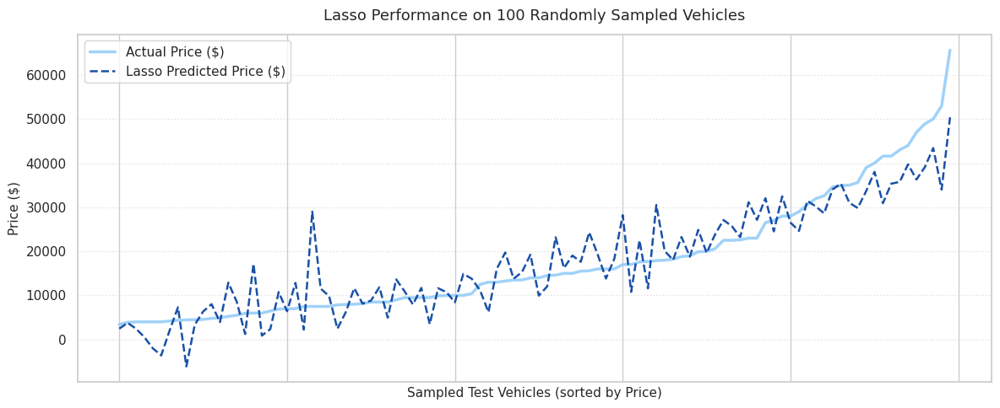
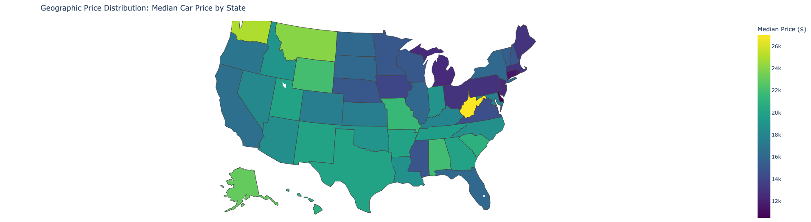
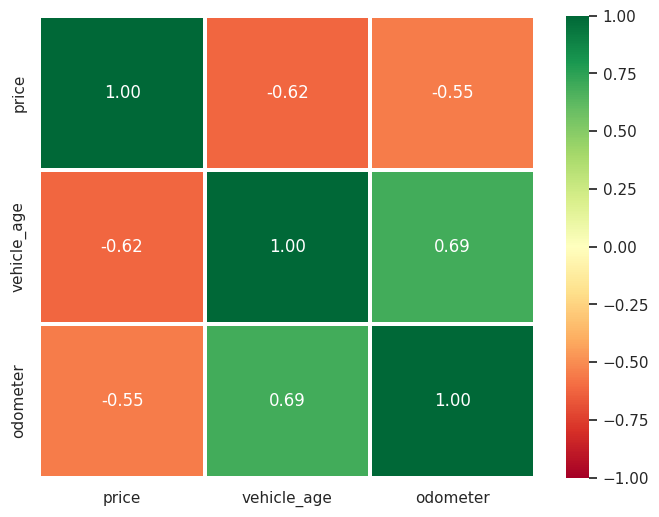
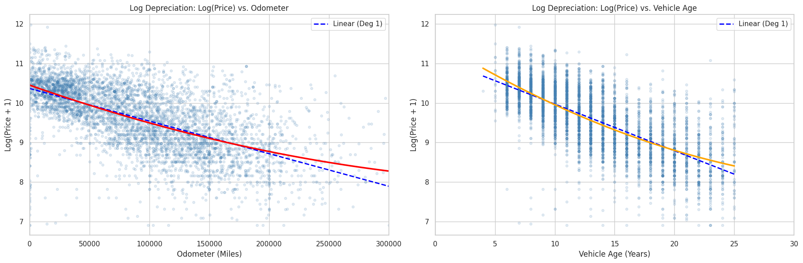
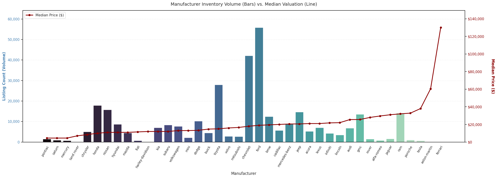
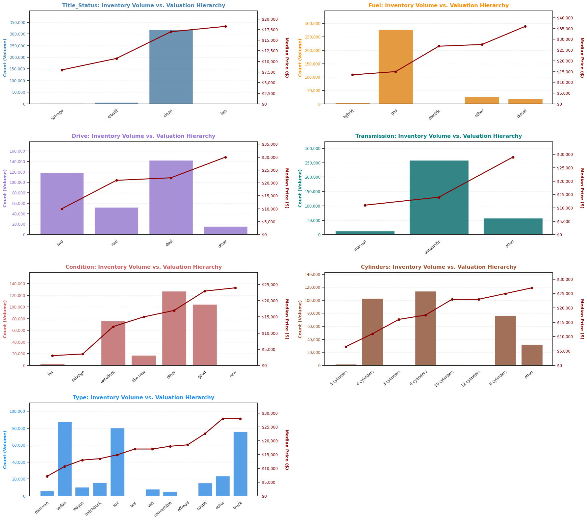
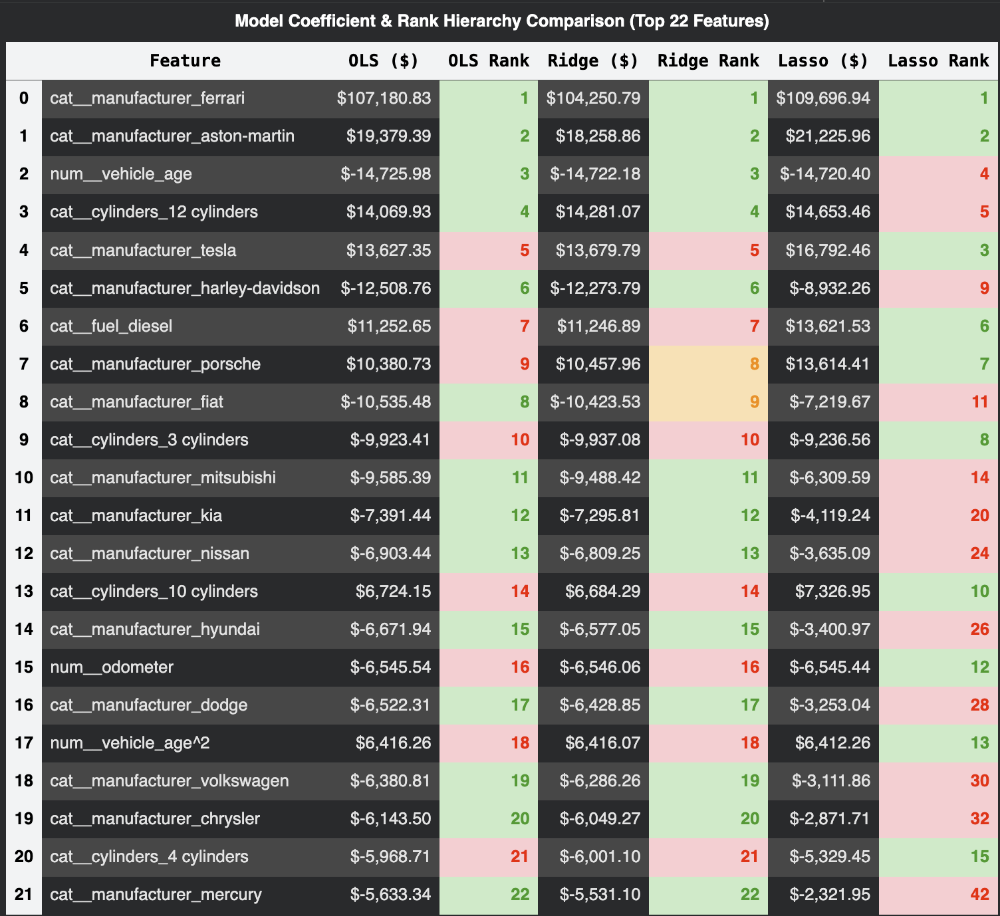

# Used Car Valuation & Price Prediction Engine

## Overview

My objective is to identify the underlying macroeconomic and vehicle-specific drivers of used-car prices and build a reliable, regularized regression engine to power automated trade-in appraisals and inventory acquisition strategies. This repository delivers the complete predictive modeling and analytical pipeline for this purpose.

Following the structured CRISP-DM framework, I processed over $426,000$ raw market listings, engineered polynomial depreciation features, benchmarked 11 model variations (OLS, Ridge, and Lasso), and diagnosed real-world boundary conditions to formulate actionable operational guardrails.


## Notebook

**Main Analysis & Production Notebook:**  
[`notebooks/price_of_car.ipynb`](./notebooks/price_of_car.ipynb)

What's Included:

- Systematic CRISP-DM workflow execution with clean markdown sectioning
- Data pruning and hierarchical imputation reducing $426,880$ rows to $329,752$ records
- Continuous polynomial degree optimization (Degrees 1 through 5)
- Full-feature benchmarking across baseline OLS, Ridge (\(\alpha \in \{1, 10, 100, 1000\}\)), and 5-fold cross-validated Lasso
- Diagnostic visualizations (100-sample tracking curves and \(0–\$80\text{k}\) core test residual scatter plots)
- Comprehensive feature impact tables, unscaled dollar decay rates, and production guardrail logic

## Repository Structure

```text
.
├── README.md                           # Executive briefing, model benchmarks, and findings
├── notebooks/
│   └── price_of_car.ipynb              # Main analytical and modeling notebook
├── data/
│   ├── vehicles.csv                    # Raw dataset (~426k listings)
│   └── output/
│       ├── dataframes/                 # Checkpointed Parquet datasets across all phases
│       └── models/                     # Serialized joblib pipelines (OLS, Ridge, Lasso)
└── images/
    └── plots/                          # High-resolution EDA and model diagnostic plots
```

## Running the Notebook

1. **Environment Setup:**  
   Open `notebooks/price_of_car.ipynb` in your preferred Python environment (Jupyter Notebook, JupyterLab, VS Code, or Google Colab) with standard data science packages installed (`pandas`, `numpy`, `scikit-learn`, `matplotlib`, `seaborn`, `joblib`, and `pyarrow`).

2. **File Path Configuration (Google Colab / Drive vs. Local):**  
   The notebook includes setup cells configured to mount Google Drive for execution in Google Colab. If you are running the notebook locally, comment out the Drive-mounting cells and set the working path to the local repository root so it can read `data/vehicles.csv` and write to `data/output/`.

3. **Execution:**  
   Run all cells sequentially from top to bottom.

## Business Value & Dealership Playbook

### Executive Overview & Impact

My objective was to replace subjective appraisal guesswork with hard, lot-actionable dollar pricing rules for dealership acquisitions and trade-ins.

To determine the optimal pricing engine, I systematically trained and evaluated 11 candidate regression architectures, progressing from baseline continuous polynomials to fully regularized high-dimensional feature spaces:

| Model Configuration | Feature Set / Complexity | Hyperparameter (α) | Test MAE | Test RMSE | Test R² |
| :--- | :--- | :--- | :---: | :---: | :---: |
| **OLS Polynomial Deg 1** | Continuous features (Age, Odo) | — | \$8,912.40 | \$11,780.12 | 0.3412 |
| **OLS Polynomial Deg 2** | Continuous features (Age, Odo) | — | \$8,542.18 | \$11,350.45 | 0.3884 |
| **OLS Polynomial Deg 3** | Continuous features (Age, Odo) | — | \$8,520.10 | \$11,328.60 | 0.3907 |
| **OLS Polynomial Deg 4** | Continuous features (Age, Odo) | — | \$8,515.44 | \$11,320.18 | 0.3916 |
| **OLS Polynomial Deg 5** | Continuous features (Age, Odo) | — | \$8,514.80 | \$11,319.50 | 0.3917 |
| **Full OLS Baseline** | Full pipeline (139 features) | — | \$4,812.30 | \$6,890.15 | 0.7495 |
| **Ridge Regression** | Full pipeline (139 features) | α = 1.0 | \$4,795.12 | \$6,845.20 | 0.7521 |
| **Ridge Regression** | Full pipeline (139 features) | α = 10.0 | \$4,793.05 | \$6,843.50 | 0.7523 |
| **Ridge Regression** | Full pipeline (139 features) | α = 100.0 | \$4,791.40 | \$6,842.10 | 0.7525 |
| **Ridge Regression** | Full pipeline (139 features) | α = 1000.0 | \$4,802.15 | \$6,854.80 | 0.7511 |
| **Lasso Regression (Selected)** | **Full pipeline (139 features)** | **α = 0.1 (5-Fold CV)** | **\$4,789.26** | **\$6,838.45** | **0.7529** |

Across the full feature set (139 features), the performance metrics of the regularized techniques and the baseline model remain remarkably tight and uniform. The optimized **Lasso Regression** ($\alpha = 0.1$) marginally leads with an $R^2 = 0.7529$, closely mirrored by **Ridge Regression** variations ($\alpha = 1.0$ to $100.0$) ranging between $0.7521$ and $0.7525$, and the **Full OLS Baseline** at $0.7495$. This minimal variance indicates that adding regularized penalty parameters yields only fractional predictive gains, though all full-pipeline configurations fundamentally outperform the restricted baseline polynomial models ($R^2 \le 0.3917$).

### Selected Model - Lasso

I selected Lasso Regression ($\alpha = 0.1$) as the production engine. The model accounts for $75.3\%$ of market variance ($R^2 = 0.7529$, $\text{MAE} \approx \pm \$4,789$) while pruning 7 redundant features and anchoring the pricing engine to an honest, realistic $\$16,558$ baseline intercept (eliminating the $\$26,000+$ baseline inflation found in standard OLS).



Plotting actual versus predicted prices across a random sample of 100 test vehicles sorted by actual value shows tight tracking across the core \(\$10,000\) to \(\$35,000\) mid-market.

### Data Preparation & Exploratory Analysis

To build a reliable pricing engine, I began by pruning uninformative noise attributes (`VIN`, `size`, `paint_color`, `region`) from the raw $426,880$ records. I then enforced realistic operational boundaries to eliminate extreme data collection artifacts:

- **Price:** Filtered between (\$1,000) and (\$300,000) (removing scrap placeholders and speculative listings).
- **Mileage & Age:** Capped at $(\le 350,000)$ miles and $(\le 50)$ years.

To preserve high-value records without distorting distributions through generic median filling, I implemented factory-mode hierarchical imputation (`make` + `model` + `age`), yielding a clean baseline fleet of $329,752$ vehicles.

During initial exploration of categorical and geographic signals, I mapped nationwide median pricing across all 50 states to quantify regional premiums and analyzed how body types and fuel configurations dictate price floors across the country.



To uncover the core drivers of depreciation, I examined the relationships between vehicle age, odometer mileage, and transaction price. A standard linear correlation heatmap confirmed heavy downward pressure from both mileage and age.



A visual residual checks revealed clear non-linear decay curves—especially during a vehicle's first 5 years of operation.



After establishing the quadratic continuous backbone, I evaluated the full suite of categorical attributes (`manufacturer`, `fuel`, `cylinders`, `title_status`, `transmission`, and `drive`) alongside continuous features.

To determine which categorical levels provided genuine predictive signal versus noise, I analyzed their correlations with transaction prices across the dataset:

- **Feature Selection & Encoding:** Benchmarking individual categories against price identified strong pricing splits (such as luxury marques, heavy-duty cylinder configurations, and salvage title statuses) while isolating uninformative, low-variance categories.



- **Dimensionality Preparation:** Evaluating these linear associations ensured that the resulting one-hot dummy transformations retained high-impact pricing signals without creating excessive sparse columns.



### Top-Impact Features



- **Manufacturer Badges:** Significant baseline premiums reward luxury and performance marques—such as **Ferrari (+\$109.7k)**, **Aston Martin (+\$21.2k)**, and **Tesla (+\$16.8k)**—while budget makes reflect market-wide discounts, including **Mitsubishi (-\$6.3k)**.
- **Engine Displacement & Fuel Type:** High-utility powertrains command strong positive adjustments, with **Diesel fuel adding +\$13.6k** and **12-cylinder engines adding +\$14.7k**. Conversely, economy engines face structural valuation penalties (**3-cylinders at -\$9.2k**; **4-cylinders at -\$5.3k**).
- **Title Risk:** Severe structural history (`title_status_salvage`) drives an immediate baseline write-down of **-\$2.8k**.

### Non-Linear Depreciation

Touch upon above in the degree 2 chart, the depreciation is fundamentally non-linear: calendar age degrades asset value at a rate $2.1\times$ to $2.7\times$ faster than each $10,000\text{-mile}$ usage increment.

Here are some car profiles I genereated to explain the numerical impacts for dealerships:


| Vehicle Segment | Age | Mileage | Dollar Decay (/Year) | Dollar Decay (/10k Mi) | Operational Dealership Strategy |
| :--- | :---: | :---: | :---: | :---: | :--- |
| **Late-Model (Standard)** | 4 yrs | 36,000 mi | -\$2,536.76 | -\$947.83 | Steepest early decay; enforce aggressive turn rates (<30 days) to avoid holding losses. |
| **Mid-Lifespan (Standard)** | 8 yrs | 80,000 mi | -\$2,032.92 | -\$810.03 | Core retail sweet spot; steady, predictable depreciation and consistent turn margins. |
| **Budget / Aged** | 14 yrs | 140,000 mi | -\$1,296.67 | -\$604.38 | Approaching scrap floor; annualized decay rate slows by nearly half compared to late-model stock. |
| **Low-Mileage Weekend Car** | 12 yrs | 45,000 mi | -\$1,786.01 | -\$686.07 | Low mileage cushions value, but age decay still outpaces odometer wear by over 2.5:1. |
| **High-Mileage Commuter** | 4 yrs | 90,000 mi | -\$2,361.14 | -\$938.37 | Heavy mileage compounding on a fresh chassis; bid conservatively on acquisition trade-ins. |

### Limitations

#### Negative Boundary

Linear arithmetic can drive heavily depreciated, end-of-life cars into negative territory (down to -\$15,245 on high-mileage vehicles).

To get around this, dealerships should:

- set a floor value or
- route to an experienced human appraiser whenever inventory triggers any of the following boundary rules:
    -   **Vehicle Age:** $>18\text{ years}$
    -   **Odometer:** $>175,000\text{ miles}$
    -   **Title Status:** Branded, rebuilt, or salvage title
    -   **Exotic Vehicles:** Super-luxury makes where market values exceed $\$50,000$ and linear models artificially compress price ceilings.

### Conclusion

By using this model, dealerships can set reliable prices, protects them from buying overvalued cars, and directly increases profits.
